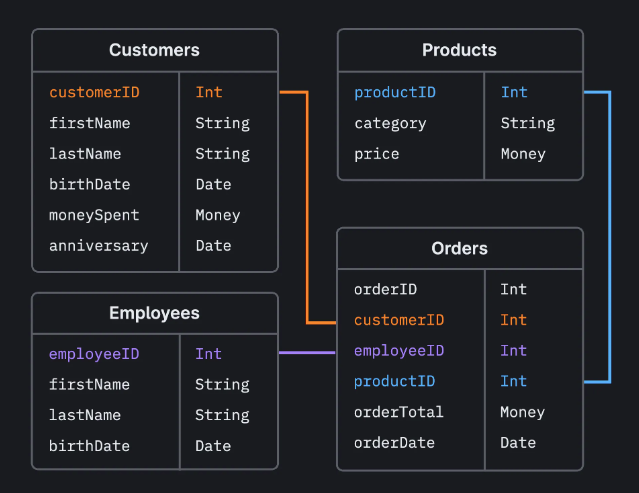

Full Guide to Learn MySQL with Theory and Examples
MySQL is a powerful and popular open-source Relational Database Management System (RDBMS) used for storing, managing, and retrieving data. This guide will equip you with the fundamentals of MySQL, taking you from the core concepts to practical examples.

1. Understanding Relational Databases
Relational Model: Data is organized in tables (collections of rows and columns), with rows representing records and columns representing attributes of those records.
Relationships: Tables can be linked through relationships defined by foreign keys, ensuring data consistency and reducing redundancy.

2. MySQL Architecture
Client-Server Model: MySQL follows a client-server architecture. The MySQL server manages the database, while clients interact with the server using SQL (Structured Query Language) statements.
Components:
MySQL Server: Handles data storage, retrieval, and manipulation.
MySQL Client: Applications or tools used to interact with the server (e.g., MySQL Workbench, command-line).

3. Data Types in MySQL
Data types define the kind of data a column can hold (e.g., numbers, text, dates) and how it's processed.
Common Data Types:
Numeric: Integers (INT, BIGINT), Decimals (DECIMAL, FLOAT)
String: Character strings (VARCHAR, CHAR), Text (TEXT, BLOB)
Date and Time: Dates (DATE), Time (TIME), Timestamps (DATETIME)

4. SQL Fundamentals
SQL is the language used to interact with relational databases like MySQL. Here's a breakdown of some essential SQL statements:

Data Definition Language (DDL):
CREATE DATABASE: Creates a new database.
CREATE TABLE: Creates a new table with specified columns and data types.
ALTER TABLE: Modifies the structure of an existing table (e.g., add/remove columns).
DROP DATABASE/TABLE: Deletes a database or table.
Data Manipulation Language (DML):
INSERT: Inserts new rows of data into a table.
UPDATE: Modifies existing data in a table.
DELETE: Removes rows of data from a table.
Data Query Language (DQL):
SELECT: Retrieves data from one or more tables based on specific conditions.

5. Working with MySQL (Examples)
    Setting Up:
Download and install MySQL Community Server from https://dev.mysql.com/downloads/mysql/.
Follow the installation instructions for your operating system.
Secure your MySQL installation by setting a strong root password.

    Connecting to MySQL:
Use a MySQL client like MySQL Workbench or the command line tool mysql.
Provide your username (usually root) and password to connect to the server.